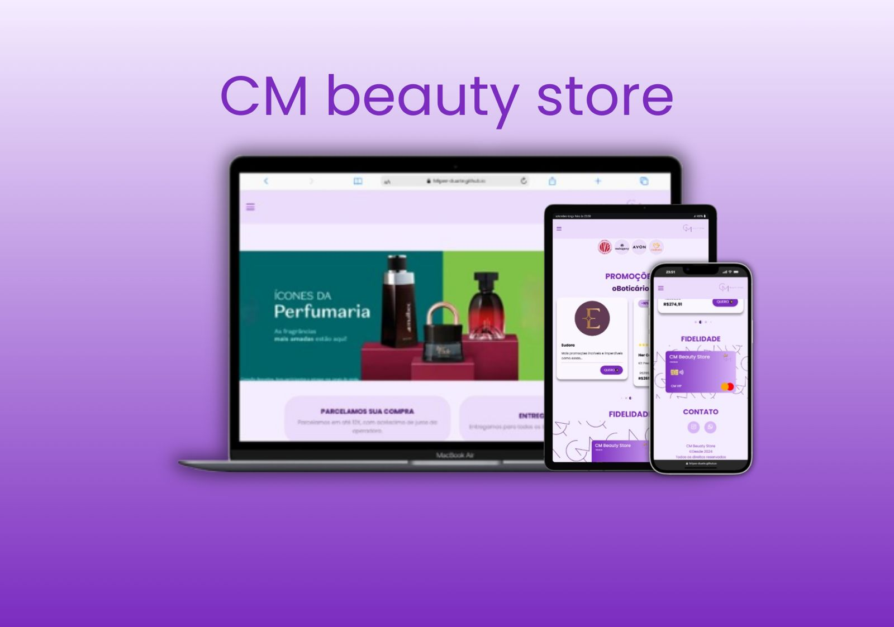

<h1 align="center"> CM beauty store</h1>

  <a href="https://felipee-duarte.github.io/landingPage-CM/">Projeto</a>&nbsp;&nbsp;&nbsp;|&nbsp;&nbsp;&nbsp;
  <a href="#">Tecnologias</a>&nbsp;&nbsp;&nbsp;|&nbsp;&nbsp;&nbsp;
  <a href="https://www.figma.com/design/DohLgwSQ2BxCVwOy9aZULA/CM?node-id=0-1&t=pfiRDjAqX01Nyjw1-1">Layout</a>&nbsp;&nbsp;&nbsp;

  

 

  

## 🚀 Tecnologias

Esse projeto foi desenvolvido com as seguintes tecnologias:

- HTML e CSS
- JavaScript
- Git e Github
- Figma

## 🛍️ Sobre o Projeto

Este projeto é uma loja virtual de cosméticos desenvolvida como demonstração de interface e funcionalidades de um e-commerce simples.

A aplicação conta com:

- Carrossel de anúncios para destacar promoções e novidades.
- Sessão de marcas e catálogos, exibindo os principais produtos organizados por fabricante.
- Carrossel de produtos de cada marca, com até 5 itens em destaque.
- Demonstração do cartão de fidelidade, incentivando a retenção e engajamento dos clientes.

O objetivo do projeto é simular a experiência de navegação em uma loja online, trazendo uma interface moderna, interativa e intuitiva

- [Acesse o projeto finalizado, online](https://felipee-duarte.github.io/Portifolio/)

## 🔖 Layout

Você pode visualizar o layout do projeto através [DESSE LINK](https://www.figma.com/design/DohLgwSQ2BxCVwOy9aZULA/CM?node-id=0-1&t=pfiRDjAqX01Nyjw1-1). É necessário ter conta no [Figma](https://figma.com) para acessá-lo.

## 📝 Licença

Esse projeto está sob a licença MIT.

---

    Feito por Felipe Duarte

